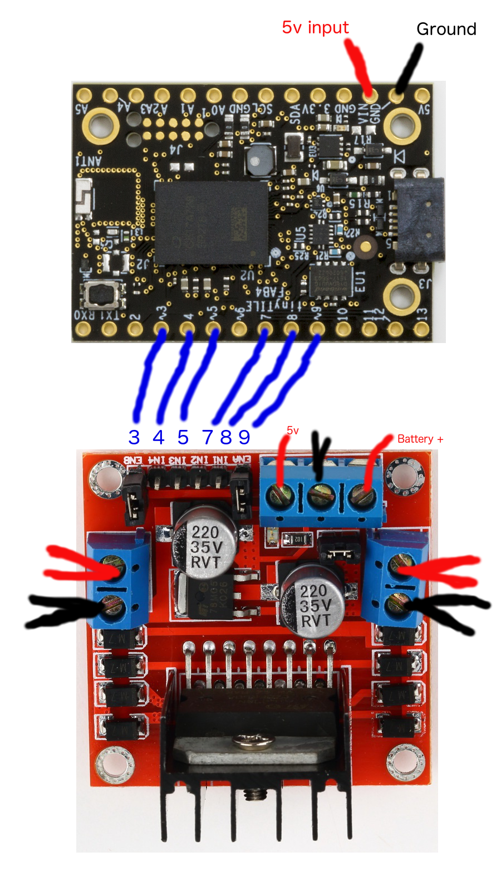
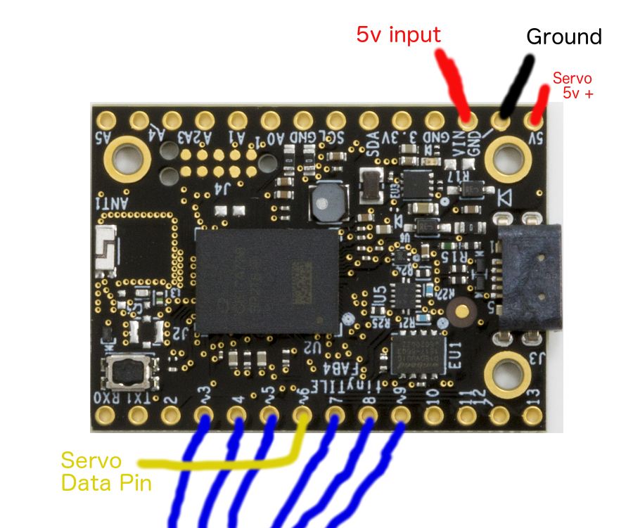
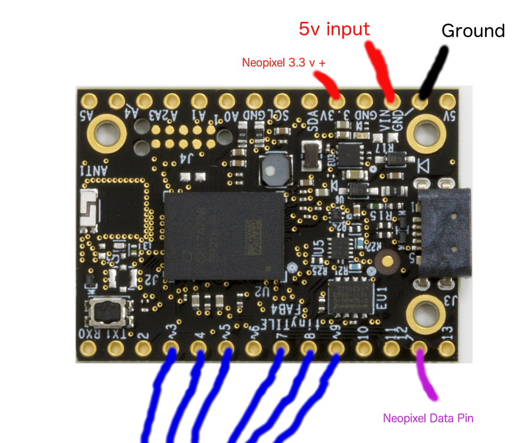

# NodeBots Day 2017


## What is Bluetooth Low Energy?


## Web Bluetooth

[https://pagenodes.com](https://pagenodes.com)


## Intel Tiny Tile

Intel's Arduino BLE chip.

This firmware for today:  https://github.com/monteslu/ble-io/tree/master/arduino/curie_plus


## Bot Assembly
[](https://www.youtube.com/watch?v=OVHW_4q0uF4)

* connect motors
* connect pins
* connect battery pack
* secure the pieces
* customize




## Bot connecting.

* service Id: `bada5555-e91f-1337-a49b-8675309fb099`

* digital Characteristic `2a56`

* analog Characteristic `2a58`

more details [here](https://github.com/monteslu/ble-io/blob/master/service.md)


## directional movement

* Right wheel forward:
digital: `[8,1]` and `[7,0]`

* Left wheel forward:
digital: `[5,1]` and `[4,0]`


* Right wheel reverse:
digital: `[8,0]` and `[7,1]`

* Left wheel reverse:
digital: `[5,0]` and `[4,1]`


## speed

* Right wheel full speed:
analog: `[9,255]`

* Left wheel full speed:
analog: `[3,255]`


* Right wheel STOP:
analog: `[9,0]`

* Left wheel STOP:
analog: `[3,0]`


## last resort...

If you're having trouble getting things going, you can import this flow into pagenodes:

```javascript
[{"id":"6hhqqI1I-Ls","type":"bluetooth out","z":"49fb777.a30e588","name":"digital","characteristicId":"2a56","bleServiceId":"bada5555-e91f-1337-a49b-8675309fb099","x":715.5,"y":286,"wires":[]},{"id":"dd6R088sIXc","type":"bluetooth out","z":"49fb777.a30e588","name":"analog","characteristicId":"2a58","bleServiceId":"bada5555-e91f-1337-a49b-8675309fb099","x":639.5,"y":473,"wires":[]},{"id":"kkgJpERfIvw","type":"iot buttons","z":"49fb777.a30e588","x":87.5,"y":180,"wires":[["vKL1gU1CZ18"]]},{"id":"vKL1gU1CZ18","type":"switch","z":"49fb777.a30e588","name":"","property":"payload","propertyType":"msg","rules":[{"t":"eq","v":"2","vt":"num"},{"t":"eq","v":"10","vt":"num"},{"t":"eq","v":"5","vt":"num"},{"t":"eq","v":"7","vt":"num"},{"t":"eq","v":"6","vt":"num"},{"t":"eq","v":"4","vt":"num"},{"t":"eq","v":"8","vt":"num"},{"t":"eq","v":"1","vt":"str"}],"checkall":"true","outputs":8,"x":149.5,"y":349,"wires":[["17AfuHvqwJM","QGG7QoVH8lo"],["qTXb5mvCQPU","qApozIfAPgs"],["17AfuHvqwJM","qApozIfAPgs"],["QGG7QoVH8lo","qTXb5mvCQPU"],["uNYP8SMzLNU"],["nkmVgTucYeA"],["nCzKIz4sCy0"],[]]},{"id":"uNYP8SMzLNU","type":"change","z":"49fb777.a30e588","name":"stop right & left","rules":[{"t":"set","p":"payload","pt":"msg","to":"[9,0,0,3,0,0]","tot":"json"}],"action":"","property":"","from":"","to":"","reg":false,"x":403.5,"y":396,"wires":[["dd6R088sIXc"]]},{"id":"nkmVgTucYeA","type":"change","z":"49fb777.a30e588","name":"med right & left","rules":[{"t":"set","p":"payload","pt":"msg","to":"[9,127,0,3,127,0]","tot":"json"}],"action":"","property":"","from":"","to":"","reg":false,"x":404.5,"y":452,"wires":[["dd6R088sIXc"]]},{"id":"nCzKIz4sCy0","type":"change","z":"49fb777.a30e588","name":"high right & left","rules":[{"t":"set","p":"payload","pt":"msg","to":"[9,255,0,3,255,0]","tot":"json"}],"action":"","property":"","from":"","to":"","reg":false,"x":423.5,"y":525,"wires":[["dd6R088sIXc"]]},{"id":"17AfuHvqwJM","type":"change","z":"49fb777.a30e588","name":"forward right","rules":[{"t":"set","p":"payload","pt":"msg","to":"[8,1,7,0]","tot":"json"}],"action":"","property":"","from":"","to":"","reg":false,"x":414.5,"y":61,"wires":[["6hhqqI1I-Ls"]]},{"id":"QGG7QoVH8lo","type":"change","z":"49fb777.a30e588","name":"forward left","rules":[{"t":"set","p":"payload","pt":"msg","to":"[5,1,4,0]","tot":"json"}],"action":"","property":"","from":"","to":"","reg":false,"x":422.5,"y":153,"wires":[["6hhqqI1I-Ls"]]},{"id":"qTXb5mvCQPU","type":"change","z":"49fb777.a30e588","name":"reverse right","rules":[{"t":"set","p":"payload","pt":"msg","to":"[8,0,7,1]","tot":"json"}],"action":"","property":"","from":"","to":"","reg":false,"x":433.5,"y":226,"wires":[["6hhqqI1I-Ls"]]},{"id":"qApozIfAPgs","type":"change","z":"49fb777.a30e588","name":"reverse left","rules":[{"t":"set","p":"payload","pt":"msg","to":"[5,0,4,1]","tot":"json"}],"action":"","property":"","from":"","to":"","reg":false,"x":434.5,"y":293,"wires":[["6hhqqI1I-Ls"]]}]
```


## servo

* config Characteristic `2a59`

* `[112, 6, 0, 0, 180, 0]` - [servo command, pin, start range, 0, end range, 0]



## servo example:


```javascript
[{"id":"V_7WtwXY_VQ","type":"iot sliders","z":"49fb777.a30e588","x":140,"y":799,"wires":[["jAnjohm1b0A"]]},{"id":"Yp-hf9o5vAQ","type":"change","z":"49fb777.a30e588","name":"set bytes","rules":[{"t":"set","p":"payload[1]","pt":"msg","to":"payload","tot":"msg"},{"t":"set","p":"payload[0]","pt":"msg","to":"6","tot":"num"}],"action":"","property":"","from":"","to":"","reg":false,"x":399,"y":888,"wires":[["kJnNBkqSU_8"]]},{"id":"40AfgngpsdE","type":"math","z":"49fb777.a30e588","name":"to degrees","operator":"*","operand":"1.8","operandType":"num","payloadProp":"payload","resultProp":"payload","payloadPropType":"msg","resultPropType":"msg","x":317,"y":822,"wires":[["Yp-hf9o5vAQ"]]},{"id":"jAnjohm1b0A","type":"switch","z":"49fb777.a30e588","name":"which slider ?","property":"slider","propertyType":"msg","rules":[{"t":"eq","v":"1","vt":"num"}],"checkall":"true","outputs":1,"x":197,"y":900,"wires":[["40AfgngpsdE"]]},{"id":"kJnNBkqSU_8","type":"bluetooth out","z":"49fb777.a30e588","name":"analog..","characteristicId":"2a58","bleServiceId":"bada5555-e91f-1337-a49b-8675309fb099","x":564,"y":841,"wires":[]},{"id":"s8LKk6Rhuy0","type":"bluetooth out","z":"49fb777.a30e588","name":"configure","characteristicId":"2a59","bleServiceId":"bada5555-e91f-1337-a49b-8675309fb099","x":560,"y":763,"wires":[]},{"id":"PkMWAFFXwzk","type":"iot buttons","z":"49fb777.a30e588","x":181,"y":687,"wires":[["hibD7ln-2Oc"]]},{"id":"hibD7ln-2Oc","type":"switch","z":"49fb777.a30e588","name":"button 1","property":"payload","propertyType":"msg","rules":[{"t":"eq","v":"1","vt":"num"}],"checkall":"true","outputs":1,"x":242,"y":752,"wires":[["ZhiSISydkI4"]]},{"id":"ZhiSISydkI4","type":"change","z":"49fb777.a30e588","name":"setup servo","rules":[{"t":"set","p":"payload","pt":"msg","to":"[112, 6, 0, 0, 180, 0]","tot":"json"}],"action":"","property":"","from":"","to":"","reg":false,"x":404,"y":708,"wires":[["s8LKk6Rhuy0"]]}]
```


## Neo pixels

* curie/neopixel Characteristic `2a5b`

* one pixel: `[3,12,2, 0,0,200]` - [pixel command, pin #, pixel #,  R, G, B]

* whole strip: `[4,12,2, 127,255,100]` - [strip command, pin #,  R, G, B]

* multiple pixels: `[3,12, 2, 127,255,100, 1, 255,0,10]` - [pixel command, pin #, pixel#,  R, G, B, pixel #,  R, G, B]



```javascript
[{"id":"2pGxMM2FsGc","type":"bluetooth out","z":"49fb777.a30e588","name":"curie","characteristicId":"2a5b","bleServiceId":"bada5555-e91f-1337-a49b-8675309fb099","x":1257,"y":1212,"wires":[]},{"id":"aeTomPptGpo","type":"inject","z":"49fb777.a30e588","name":"red strip","topic":"","payload":"[4,12,255,0,0]","payloadType":"json","repeat":"","crontab":"","once":false,"allowDebugInput":false,"x":818,"y":1079,"wires":[["2pGxMM2FsGc"]]},{"id":"SQgYsSlZ0KA","type":"inject","z":"49fb777.a30e588","name":"black strip","topic":"","payload":"[4,12, 0,0,0]","payloadType":"json","repeat":"","crontab":"","once":false,"allowDebugInput":false,"x":793,"y":1137,"wires":[["2pGxMM2FsGc"]]},{"id":"cW911aALG6U","type":"inject","z":"49fb777.a30e588","name":"pixel 2 blue","topic":"","payload":"[3,12,2, 0,0,200]","payloadType":"json","repeat":"","crontab":"","once":false,"allowDebugInput":false,"x":810,"y":1197,"wires":[["2pGxMM2FsGc"]]},{"id":"me48DP6hmIo","type":"inject","z":"49fb777.a30e588","name":"pixel 0 - 3 first half rainbow","topic":"","payload":"[3,12,  0, 148,0,211,  1, 75,0,130,  2, 0,0,255,  3, 0,255,0 ]","payloadType":"json","repeat":"","crontab":"","once":false,"allowDebugInput":false,"x":835,"y":1259,"wires":[["2pGxMM2FsGc"]]},{"id":"pPIUgLhV-7g","type":"inject","z":"49fb777.a30e588","name":"pixel 4 - 7 second half rainbow","topic":"","payload":"[3,12,  4, 255,255,0,  5, 255,127,0,  6, 255,0,0,  7, 127,0,0 ]","payloadType":"json","repeat":"","crontab":"","once":false,"allowDebugInput":false,"x":859,"y":1321,"wires":[["2pGxMM2FsGc"]]}]
```
